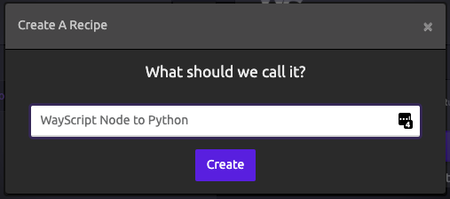
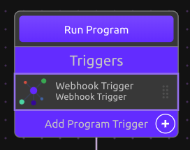
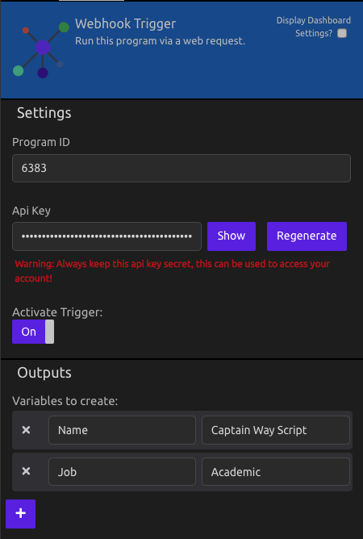
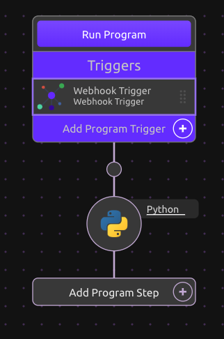
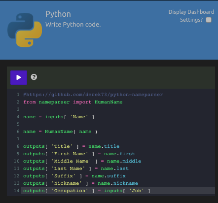
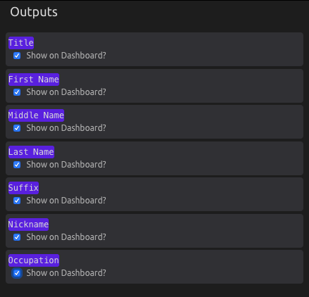
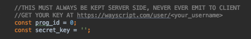
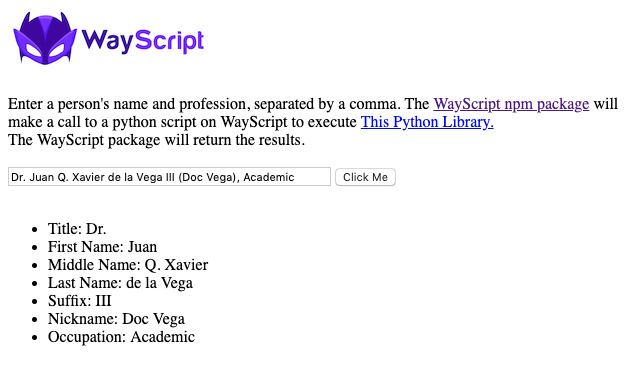

# WayScript Node to Python Example

WayScript allows you to execute python scripts and receive results back via a request to the <a href="https://www.npmjs.com/package/wayscript">WayScript npm package</a>.
In this example, we use a Node server to run a WayScript program and receive the results back. 

In this example, a user can submit a name and occupation via a node server, and the data is passed to a python script that executes the 
<a href="https://github.com/derek73/python-nameparser">Name Parser</a> library. The results are returned to the Node Server in real time. 

## Setup Node Application

If you don't already have it installed, install node: https://nodejs.org/en/

In the app root directory, type
```
npm install 
```

To Run The Server:
```
node app.js
```

If running properly, you should see: "WayScript Node Example Running" in your terminal

In your browser go to http://127.0.0.1:8081

## Setup WayScript Program

1) If you don't have one already, register for a WayScript account at https://wayscript.com.

2) Create a New Program<br>
    

3) Add a Webhook Trigger<br>
    <br>
    - In the Outputs section of the Trigger Module, create a Variable Called 'Name' and give it a default name (i.e. Captain Way Script III )
    - In the Outputs section of the Trigger Module, create a Variable Called 'Job' and give it a default value (i.e. Academic )
    - Take note of your Program ID and API Key<br><br>
    

4) Drag in the Python Module as your next step<br>
    

5) Copy and paste your Python Script into the CodeBox<br>
    ```python
    #https://github.com/derek73/python-nameparser
    from nameparser import HumanName
    
    name = inputs[ 'Name' ]
    
    name = HumanName( name )
    
    outputs[ 'Title' ] = name.title
    outputs[ 'First Name' ] = name.first
    outputs[ 'Middle Name' ] = name.middle
    outputs[ 'Last Name' ] = name.last
    outputs[ 'Suffix' ] = name.suffix
    outputs[ 'Nickname' ] = name.nickname
    outputs[ 'Occupation' ] = inputs[ 'Job' ]
    ```

    

6) Set your outputs to return via the WayScript Request
    - On the top of the Python Module, click "Display Dashboard Settings"
    - Next to Each Output (Scroll Down in the Python Module) click "Show on Dashboard"
    - You have now set each output to return via the Webhook

    

## Run App

1) Open your app.js file and input your Program ID and API Key (shown in the Webhook Trigger) into the file.

    

2) Restart your Node Server to update your changes and refresh the site page.
    ```
    node app.js
    ```
3) Press the "Click Me"  button and the program executes the Python code and returns the results to your Node Server!

    
